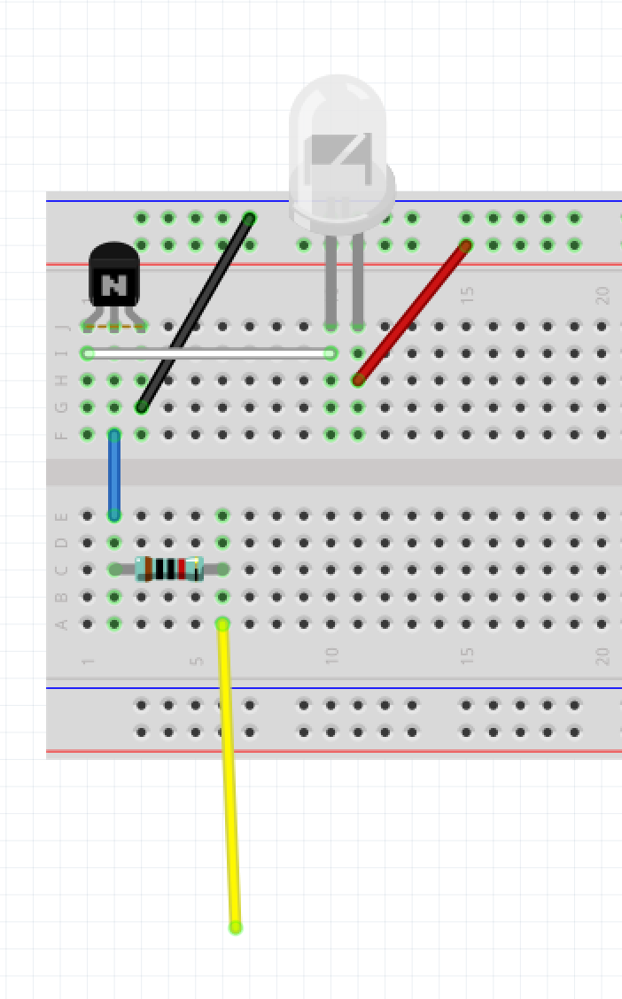
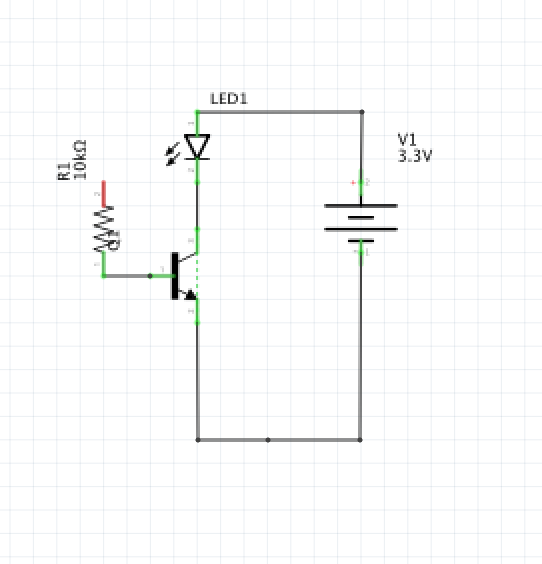
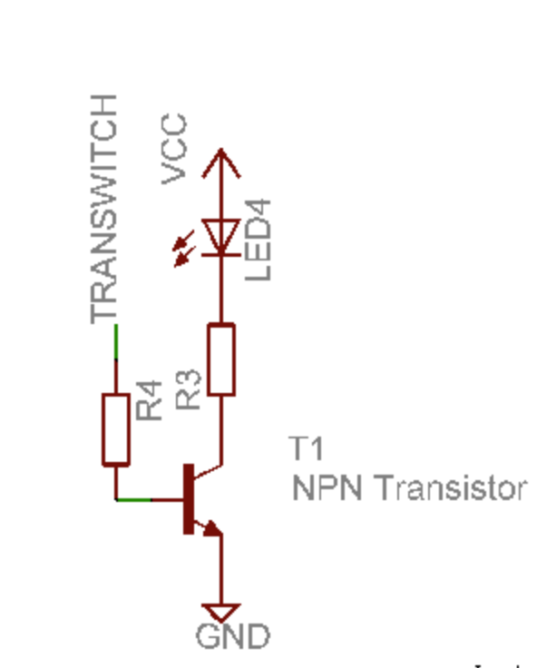

# IR LED "transmitter" emulating an IR remote control

## Description

Transmitting the infrared signal for a Sony remote uses a pulse code modulation with digital codes. The Raspberry PI GPIO pins can be used to send or receive IR remote codes. For an IR transitter, a simple transistor-based circuit can amplify the current of the GPIO digital signal (~20mA tops). This allows a Pi to control an IR LED and drive it at higher power for a stronger IR remote signal output.

## Design Ideas

Elsewhere in the code, the Raspberry Pi and LIRC are configured to use "Broadcom "BCM pin 22" _aka_ Pi GPIO header "physical pin 15" _aka_ "Wiring Pi pin 3" as the GPIO for IR sending. This header pin is used as an output. Its signal is sent via wire through a resistor to the Base terminal on an NPN transistor.  This signal is use to turn on or off the current through the IR LED.

## Circuit

Wiring up the IR LED + transistor driver can be done on a mini-breadboard (eleven row).

#### Breadboard circuit

#### Schematic based on Breadboard Circuit

#### Another Circuit schematic

I didn't include the current limit resistor in the LED path, but it probably should be added for a better IR LED lifetime.

#### On Semi P2N2222A pinout

Other NPN transistor can be used.

## Fritzing file

[transistor_IR_LED_transmitter.fzz](transistor_IR_LED_transmitter.fzz)
